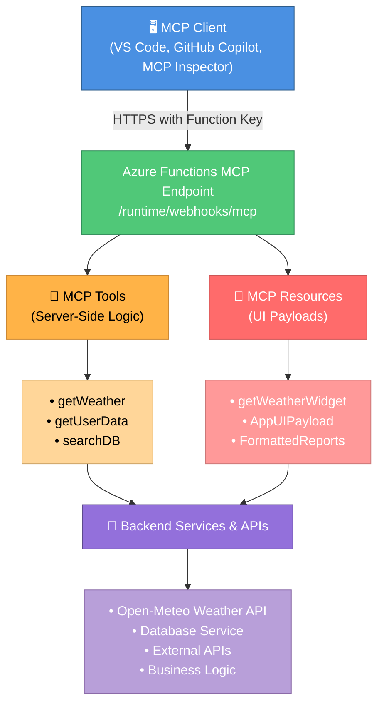

# Host MCP Apps on Azure Functions: Fast TypeScript Guide

Azure Functions makes MCP app hosting straightforward: build locally, expose a secure remote endpoint, and deploy quickly with azd.

This repository demonstrates the feature using a Weather app as the sample implementation.

## What Are MCP Apps?

MCP (Model Context Protocol) apps extend the capabilities of AI assistants and clients by providing:

- **MCP Tools**: Remote functions that clients call to perform actions (e.g., fetch data, update records, call APIs)
- **MCP Resources**: Static or dynamic content that clients can read and reference (e.g., documents, formatted data, UI payloads)
- **Bidirectional Communication**: Tools return structured data and resources serve formatted responses, enabling rich interactions

By hosting MCP apps on Azure Functions, you get a serverless, production-ready platform with built-in security, scaling, and deployment automation.

## MCP App Hosting as a Feature

With this pattern, you can host MCP apps that include:

- **MCP tools** (server-side logic): Handle requests from clients, call backend services, return structured data
- **MCP resources** (UI payloads such as app widgets): Serve interactive HTML, JSON documents, or formatted content for rich client experiences
- **Secure remote access** over HTTPS with function keys: Built-in authentication via Azure Functions system keys or headers
- **Repeatable provisioning and deployment** with Bicep and azd: Infrastructure as Code for consistent cloud environments
- **Local-first development**: Test and debug tools locally before deploying to the cloud
- **Scaling and reliability**: Azure Functions handles auto-scaling, retries, and monitoring out of the box

The Weather app in this repo is an example of this feature, not the only use case.

## Architecture Overview



## Example Used in This Repo: Weather App

The sample implementation includes:

- A **GetWeather MCP tool** that fetches weather by location (calls Open-Meteo geocoding and forecast APIs)
- A **Weather Widget MCP resource** for app-style UI rendering (interactive HTML dashboard)
- A TypeScript service layer that abstracts API calls and data transformation
- Local and remote testing flow for MCP clients (via MCP Inspector, VS Code, or custom clients)

## Quick Start

Run locally:

```bash
npm install
npm run build
func start
```

Local endpoint:

```text
http://0.0.0.0:7071/runtime/webhooks/mcp
```

Deploy to Azure:

```bash
azd provision
azd deploy
```

Remote endpoint:

```text
https://<function-app-name>.azurewebsites.net/runtime/webhooks/mcp
```

## Minimal TypeScript Snippet

```typescript
app.mcpTool("getWeather", {
  toolName: "GetWeather",
  description: "Returns current weather for a location via Open-Meteo.",
  toolProperties: {
    location: arg.string().describe("City name to check weather for")
  },
  handler: getWeather,
});
```

## Resource Trigger Snippet (Weather App Hook)

```typescript
app.mcpResource("getWeatherWidget", {
  uri: "ui://weather/index.html",
  resourceName: "Weather Widget",
  description: "Interactive weather display for MCP Apps",
  mimeType: "text/html;profile=mcp-app",
  handler: getWeatherWidget,
});
```

## GitHub Links (Full Source)

- TypeScript sample repo: https://github.com/Azure-Samples/remote-mcp-functions-typescript
- Weather tool implementation: https://github.com/Azure-Samples/remote-mcp-functions-typescript/blob/main/src/functions/weatherMcpApp.ts
- Weather service implementation: https://github.com/Azure-Samples/remote-mcp-functions-typescript/blob/main/src/functions/weatherService.ts
- Weather widget app implementation: https://github.com/Azure-Samples/remote-mcp-functions-typescript/blob/main/src/app/src/weather-app.ts
- .NET sample: https://github.com/Azure-Samples/remote-mcp-functions-dotnet
- Python sample: https://github.com/Azure-Samples/remote-mcp-functions-python
- MCP Inspector: https://github.com/modelcontextprotocol/inspector

## Final Takeaway

Use Azure Functions as the MCP app hosting feature, then plug in your own domain logic. The Weather app here is the reference sample showing how quickly you can go from local development to a secure remote MCP endpoint.
